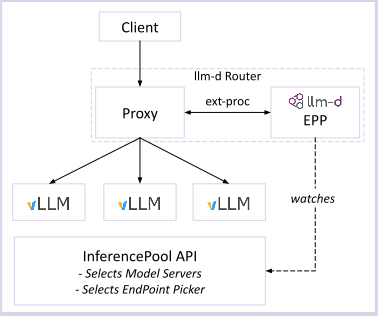
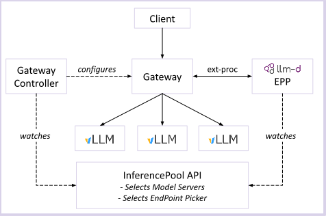

# Proxy

The proxy is the entry point for inference requests in llm-d, receiving client traffic and routing it to the optimal model server via the EPP. It supports two deployment modes: **Standalone Mode** and **Gateway Mode**.

## Functionality

llm-d leverages [External Processing](https://www.envoyproxy.io/docs/envoy/latest/configuration/http/http_filters/ext_proc_filter) to extend production-grade proxies such as Envoy with the "LLM inference-aware" request routing implemented in the llm-d EPP. In this way, llm-d re-uses the rich existing ecosystem of high-performance, production-quality proxy technologies in the Kubernetes ecosystem.

The proxy's job is to:

- **Accept incoming inference requests** from clients (OpenAI-compatible API)
- **Consult the EPP** via ext-proc to determine the optimal backend endpoint
- **Route the request** to the selected model server pod
- **Stream responses** back to the client

### Request Flow (Both Modes)

Regardless of the deployment mode, the request flow is the same:

1. Client sends an inference request to the proxy
2. The proxy's ext-proc filter calls the EPP
3. The EPP evaluates endpoints using its plugin pipeline (handlers, filters, scorers, picker)
4. The EPP returns the selected endpoint address
5. The proxy forwards the request to that model server pod
6. The model server sends the response back to the proxy (which streams the result through the EPP for post-processing)

---

## Standalone Mode

The standalone mode deploys a proxy as a sidecar to the EPP, offering a lightweight, flexible deployment mode without requiring Gateway API infrastructure.

### When to Use

Standalone deployments are intended for workloads where the machinery of Gateway API creates too much operational overhead. This includes:

- Clusters using legacy Ingress controllers.
- Basic testing and local evaluations.
- Batch inference workloads.
- RL post-training pipelines.

### Architecture

In standalone mode, the conformant proxy (e.g., Envoy) runs alongside the EPP in the same pod.

- **Communication**: `ext-proc` communication happens over `localhost`.
- **Simplification**: No `Gateway`, `HTTPRoute`, or gateway controller is needed.
- **Access**: Traffic is sent directly to the EPP pod's externally exposed port.

<p align="center">
  
</p>

---

## Gateway Mode (Inference Gateway)

Gateway Mode, also known as the **Inference Gateway**, leverages the official Kubernetes Gateway API project focused on L4 and L7 networking, representing the next generation of Kubernetes Load Balancing and Service Mesh APIs.

### When to Use

Gateway Mode is targeted at production environments that require:

- **Shared Infrastructure**: A single, shared Gateway can host multiple HTTP/gRPC routes for both inference workloads (represented as `InferencePool`) and traditional applications (standard Kubernetes `Service` objects).
- Integration with cloud-native L7 networking solutions (Istio, GKE Gateway, Agentgateway).
- Multi-cluster load balancing.
- Advanced traffic management (weighted splitting, mirroring).
- Exposure of endpoints to external workloads with robust control.

### Architecture

The [Gateway API Inference Extension (GAIE)](https://gateway-api-inference-extension.sigs.k8s.io/) extends Gateway API by leveraging Envoy's External Processing to inject LLM-aware load balancing into the production-grade networking provided by the Gateway provider.

<p align="center">
  
</p>

To connect an **InferencePool** (and the EPP it selects) to a **Gateway**, you use an **HTTPRoute** that references the pool as its backend. One of the powerful features of Gateway Mode is the ability to host complex routing topologies: a single `Gateway` can host multiple `HTTPRoute` objects, and each route can be configured with multiple **InferencePool** backends (e.g., for canary rollouts or traffic splitting) or a standard Kubernetes **Service**.

The following diagram illustrates the hierarchical routing structure in Gateway Mode, showing how requests are matched and distributed across multiple InferencePools and traditional Services:

```text
                          +-----------------------+
                          |        Gateway        |
                          | (Industry-Grade Proxy)|
                          +-----------+-----------+
                                      |
                  ____________________|____________________
                 |                                         |
         Path/Header Match                         Path/Header Match
         +-------v-------+                         +-------v-------+
         |   HTTPRoute   |                         |   HTTPRoute   |
         |  (Inference)  |                         | (Traditional) |
         +-------+-------+                         +-------+-------+
                 |                                         |
         ________|________                                 |
        |                 |                                |
   Match/Weight      Match/Weight                    Match/Weight
 +-----v-------+   +-----v-------+                 +-------v-------+
 |InferencePool|   |InferencePool|                 |    Service    |
 |     (A)     |   |     (B)     |                 |     (Web)     |
 +-------------+   +-------------+                 +---------------+
```

Traffic is first matched against an `HTTPRoute` rule (typically using **path** or **header** matches). If the selected backend in that rule is an `InferencePool`, the request is parked while the EPP configured for that `InferencePool` is consulted for an inference-optimized routing decision.

<table>
<tr>
<td><b>Example Gateway</b></td>
<td><b>Example HTTPRoute</b></td>
</tr>
<tr>
<td valign="top">

```yaml
apiVersion: gateway.networking.k8s.io/v1
kind: Gateway
metadata:
  name: my-gateway
spec:
  gatewayClassName: istio
  listeners:
    - name: http
      protocol: HTTP
      port: 80
```

</td>
<td valign="top">

```yaml
apiVersion: gateway.networking.k8s.io/v1
kind: HTTPRoute
metadata:
  name: my-http-route
spec:
  parentRefs:
    - group: gateway.networking.k8s.io
      kind: Gateway
      name: my-gateway
  rules:
    - backendRefs:
        - group: inference.networking.k8s.io
          kind: InferencePool
          name: my-infpool
          port: 8000
      matches:
        - path:
            type: PathPrefix
            value: /
```

</td>
</tr>
</table>

### Deployment Guides

llm-d provides [Gateway Mode deployment guides](../../../well-lit-paths/README.md) for the following Gateways:

- [Istio](https://github.com/llm-d/llm-d/blob/main/guides/prereq/gateways/istio.md)
- [GKE Gateway](https://github.com/llm-d/llm-d/blob/main/guides/prereq/gateways/gke.md)
- [Agentgateway](https://github.com/llm-d/llm-d/blob/main/guides/prereq/gateways/agentgateway.md)
