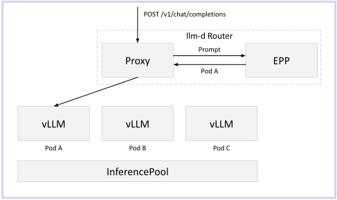
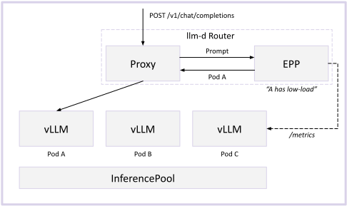

# Optimized Baseline

Traditional HTTP requests are fast, uniform, and cheap. Standard round-robin request scheduling strategies balance this load well.

LLM requests break all three assumptions. They are:

* **Multi-turn** - conversations and agentic tool loops send the same growing prefix repeatedly
* **Slow** - a single request can take over a minute generating tokens
* **Non-uniform** - range from 1000s of reasoning tokens to a 100k+ context tokens

The llm-d Router injects awareness of the LLM-workload into the load-balancing layer considering **prefix-cache affinity** and **server load metrics**.

> [!NOTE]
> This guide demonstrates one approach to prefix- and load-aware routing. The llm-d Router supports other options as well, including session affinity and active request based routing, which make no assumptions about the router's ability to parse the request or probe the servers. See [configuration](../architecture/core/router/epp/configuration.md) for more details on the available scorers, or [precise prefix-cache-aware routing](precise-prefix-cache-aware.md) for KV-event-driven scoring.

## Deploy

See the [optimized baseline guide](https://github.com/llm-d/llm-d/tree/main/guides/optimized-baseline) for manifests and step-by-step deployment.

## Architecture

### Prefix-Aware Scheduling

EPP maintains a view of each endpoints's prefix-cache state in memory. When a request arrives, it identifies which pod already holds the matching prefix in KV-cache and routes the request there. For multi-turn workloads, this optimization is critical to avoid excessive recomputation in a scale-out setting.

### Load-Aware Scheduling

EPP continuously probes each endpoints's metrics by scraping `/metrics` at a regular interval (50ms default). It scores endpoints on queue depth, running requests, and KV-cache utilization to schedule requests to the endpoint with the lowest load, avoiding hotspots caused by heterogeneous request patterns.

## Further Reading

See [EPP Architecture](../architecture/core/router/epp/README.md) for more details.
