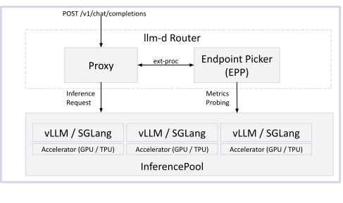

# Architecture

High-level guide to llm-d architecture. Start here, then dive into specific guides.

## Core

At its core, llm-d contains the following key layers:

- **Proxy** - Accepts requests from the users. It can be deployed as a Standalone Envoy Proxy or via Kubernetes Gateway API. The Proxy consults an EndPoint Picker (EPP) via the ext-proc protocol to determine which Model Server is optimal for a request.

- **EndPoint Picker (EPP)** - Selects which endpoint in an `InferencePool` is optimal for a specific request. The EPP is the "brains" of the scheduling and queuing decisions that consider prefix-cache affinity, load and saturation signals, prioritization, and (optionally) disaggregated serving.

- **InferencePool** - The InferencePool API defines a group of Model Server Pods dedicated to serving AI models. An InferencePool is conceptually similar to a Kubernetes Service. Each InferencePool has an associated EPP which selects the optimal pod for a request.

- **Model Server** - The Model Server (like vLLM or SGLang) executes the model on hardware accelerators. The Model Servers can be deployed through any deployment process, joining an `InferencePool` via Kubernetes labels and selectors.

For more details on the core components, see:
- [Proxy](core/proxy.md)
- [EPP](core/epp/README.md)
- [InferencePool](core/inferencepool.md)
- [Model Server](core/model-servers.md)

## Advanced Patterns

llm-d's core design can be extended with optional advanced patterns, which can be classified in the following types:

### Disaggregation

In disaggregated serving, a single inference request is split into multiple steps (e.g. Prefill phase and Decode phase). llm-d's EPP supports the concept of disaggregation and leverages the protocols of the Model Servers (vLLM and SGLang) to execute the multi-step inference process.

See [Disaggregation](advanced/disaggregation/README.md) for complete details on the disaggregated serving design.

### EPP "Consultants"

By default, the llm-d EPP leverages scorers that are used to selecting the optimal pod, leveraging:
- The Model Server's exported Prometheus metrics
- In-memory data structures (most notably, a prefix-cache tree that approximates the KV cache state of each pod)

Should your use case require it, the EPP can optionally query 'consultant' components to execute arbitrary scoring logic and enable advanced patterns. For more details on example "Consultants", see:
- [Latency Predictor](advanced/latency-predictor.md), which trains an XGBoost model online (using measured latency of previous requests) for scheduling decisions
- [KV-Cache Indexer](advanced/kv-indexer.md), which maintains a globally consistent, event-driven view of each Model Server's KV cache state and serves as the foundation for advanced prefix-cache-aware scheduling (multimodal, HMA-aware routing, and more)

### Autoscaling

With autoscaling, Model Servers are added or removed automatically to keep serving capacity aligned with inference demand. llm-d supports two autoscaling approaches — HPA/KEDA for standard Kubernetes-native scaling and the Workload Variant Autoscaler (WVA) for globally optimized scaling that minimizes cost while working toward SLO targets. Both consume scaling signals drawn from three categories:

- **Supply-side** — Remaining resource headroom on backends (KV cache capacity, compute throughput) versus current resource consumption (tokens in use, model server queue depth). Scales when utilization leaves insufficient headroom.

- **Demand-side** — EPP flow-control signals (queue depth and active request counts) versus current processing capacity. Scales when pending requests accumulate faster than backends can drain them.

- **SLO-driven (Experimental)** — Observed request arrival rate versus the maximum rate backends can sustain while meeting latency targets. Learns server behavior online and scales proactively to keep time to first token (TTFT) and inter-token latency (ITL) within configured targets.

See [Autoscaling](advanced/autoscaling/README.md) for complete details on the autoscaling design.
